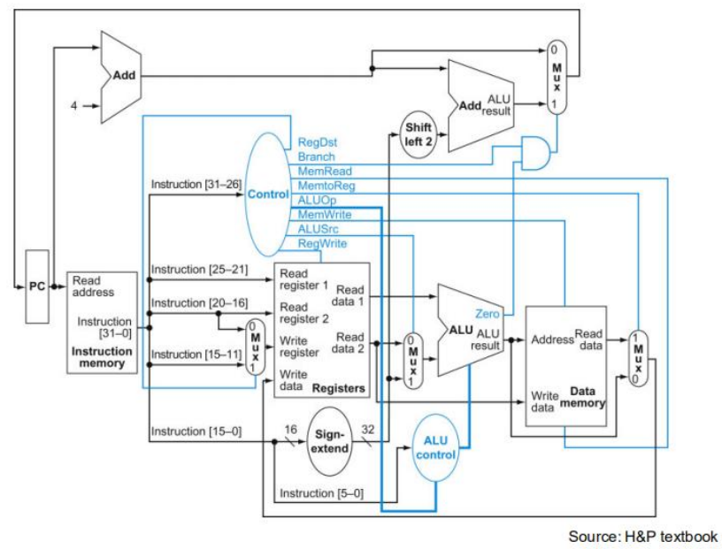
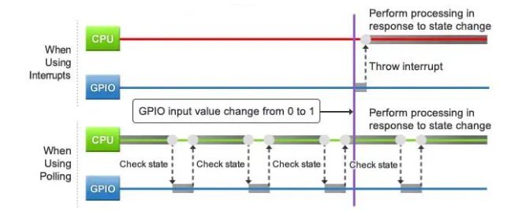
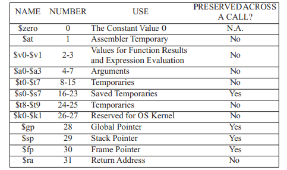
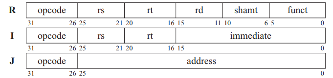

# CS214 2023s Project Quick Start

## 0 Deadlines & References

| 答辩时间           | 代码   | 文档   | 得分系数 |
| -------------- | ---- | ---- | ---- |
| 5.22 (-2 days) | 5.22 | 5.29 | 1.05 |
| 5.29 | 5.29 | 6.5  | 1    |

[Project 要求](https://bb.sustech.edu.cn/bbcswebdav/pid-379028-dt-content-rid-13103060_1/courses/CS214-30000386-2023SP/Computer%20Orgnization%E5%A4%A7%E4%BD%9C%E4%B8%9A-cs214-%E5%88%9D%E7%A8%BF.pdf)

[MINISYS 硬件手册](https://bb.sustech.edu.cn/bbcswebdav/pid-379291-dt-content-rid-13134743_1/courses/CS214-30000386-2023SP/Minisys%E7%A1%AC%E4%BB%B6%E6%89%8B%E5%86%8C1.1.pdf) 

[Fros1er/Simple_Minisys_CPU](https://github.com/Fros1er/Simple_Minisys_CPU)

[MIPS Reference Data](https://inst.eecs.berkeley.edu/~cs61c/resources/MIPS_Green_Sheet.pdf)

## 1 Todos

### 1.1 Basic

#### 1.1.1 ISA

这一部分主要就是实现 Minisys 的基本指令，以及 MIPS 中的一些扩展。在硬件上，我们参考 Minisys 的 datapath 进行模块化设计。

##### 需要实现的（子）模块

1. CPU clock generator
   
   CPU 的时钟信号发生器，可以使用 vivado 提供的 clk_wiz IP 核实现。

2. Instruction fetcher
   
   根据 PC 寄存器从 instruction memory 中取得指令。Inst. memory 可以直接使用 vivado 提供的 block memory 实现。
   
   如果考虑实现 bonus 部分的中断支持，可以实现一个 VIC (Vector interrupt control)，VIC 中定义了一系列具有优先级的中断信息，可以令 CPU 停下当前工作，通过 handler 进行中断处理。如果我们实现了 VIC，在与外设的交互中，就可以使用中断（而不是轮询）实现 I/O 以实现更高的性能。
   
   
   
   与 PC 相关的指令可以考虑在这里对 PC 进行更改。

3. Registers
   
   寄存器组。包括 32 个通用寄存器。
   
   

4. ALU
   
   算数的。实现有符号/无符号的加法/减法，逻辑运算，大小对比即可。

5. Control unit
   
   对 Inst. fetcher 提供的指令进行解析，比较麻烦的一部分。

6. Data Memory
   
   数据内存，可以直接使用 block memory 实现。具有 32 位的寻址空间，寻址单位 1byte，一次写入 4bytes，数据空间不知道，就 128M 吧（？）。这里注意，因为（我打算）使用 MMIO（内存映射IO，也就是说将一段内存地址与外设的输入输出值进行映射，这样方便实现 bonus 中的功能），使用在 data memory 的开始字段需要保留一些空间用于 IO 的内存映射。

##### 需要实现的指令

| Type | Name | Type | Name  | Type | Name  | Type | Name |
| ---- | ---- | ---- | ----- | ---- | ----- | ---- | ---- |
| R    | sll  | R    | srav  | R    | subu  | R    | slt  |
| R    | srl  | R    | jr    | R    | and   | R    | sltu |
| R    | sllv | R    | add   | R    | or    | -    | -    |
| R    | srlv | R    | addu  | R    | xor   | -    | -    |
| R    | sra  | R    | sub   | R    | nor   | -    | -    |
| I    | beq  | I    | sw    | I    | slti  | I    | ori  |
| I    | bne  | I    | addi  | I    | sltiu | I    | xori |
| I    | lw   | I    | addiu | I    | andi  | I    | lui  |
| J    | j    | J    | jal   | -    | -     | -    | -    |

#### 1.1.2 I/O

这里我想使用 MMIO 进行开发，所以说约定好需要使用到的管脚对应的内存空间就行了。然后使用时钟分频对内存空间进行不那么快的访问，直接用更新内存数据就行。

需要实现一个 I/O 模块。

#### 1.1.3 Uart

可以直接使用 vivado 提供的 uart IP 核解决。通过 uart 串口将指令写入 instruction memory。

需要实现一个 uart 模块。

### 1.2 Bonus

Bonus 部分看了一下，比较好玩而且容易实现的：

- 实现对复杂外设接口的支持（如VGA接口、小键盘接口等）
  
  可以使用 MMIO 以及 VIC 中断轻松实现。我们可以实现一个小键盘的接口~~因为已经有现成的代码可以参考~~

- 实现对中断的支持
  
  也就是实现一个 VIC 协处理器。具体可以参考 [Vector Interrupt Controller](https://upload.wikimedia.org/wikiversity/en/f/fa/ARM.2ASM.VIC.20220725.pdf)，我还没细看。

#### 1.1.4 模块列表

| 名称               | 功能 | 负责人 |
| ------------------ | ---- | ------ |
| cpu_top            |      | kl     |
| cpu_clk            |      | kl     |
| instruction_fetch  |      | glh    |
| instruction_memory |      | ckr    |
| vic                |      | glh    |
| registers          |      | glh    |
| control            |      | kl     |
| alu                |      | kl     |
| data_memory        |      | glh    |
| io                 |      | ckr    |
| dma                |      | ckr    |
| uart               |      | ckr    |
| seg                |      | ckr    |
| keyboard           |      | ckr    |

## 2 约定

**对于代码，我们采用如下风格：小写单词+下划线命名，常量全大写，运算符中间打空格！！！**

### 2.1 ISA Machine code

#### 2.1.1 R Type

| Name                            | Mnemonic | funct (ins[5:0]) | Note        |
| ------------------------------- | -------- | ---------------- | ----------- |
| Shift left logical              | sll      | 000000           | 移动 shamt 的值 |
| Shift right logical             | srl      | 000010           | 同上          |
| Shift left logical variable     | sllv     | 000100           |             |
| Shift right logical variable    | srlv     | 000110           |             |
| Shift right arithmetic          | sra      | 000011           | 同上，忽略溢出     |
| Shift right arithmetic variable | srav     | 000111           | 同上          |
| Jump register                   | jr       | 001000           | PC=rs       |
| Add                             | add      | 100000           |             |
| Add unsigned                    | addu     | 100001           |             |
| Substract                       | sub      | 100010           |             |
| Substract unsigned              | subu     | 100011           |             |
| And logical                     | and      | 100100           |             |
| Or logical                      | or       | 100101           |             |
| Xor logical                     | xor      | 100110           |             |
| Nor logical                     | nor      | 100111           |             |
| Set less than                   | slt      | 101010           |             |
| Set less than unsigned          | sltu     | 101011           |             |

#### 2.1.2 I Type

| Name                             | Mnemonic | OpC (ins[31:26]) | Note |
| -------------------------------- | -------- | ---------------- | ---- |
| Branch if equal                  | beq      | 000100           |      |
| Branch if not equal              | bne      | 000101           |      |
| Load word                        | lw       | 100011           |      |
| Save word                        | sw       | 101011           |      |
| Add immidiate                    | addi     | 001000           |      |
| Add immidiate unisigned          | addiu    | 001001           |      |
| Set less than immidiate          | slti     | 001010           |      |
| Set less than immidiate unsigned | sltiu    | 001011           |      |
| And immidiate                    | andi     | 001100           |      |
| Or immidiate                     | ori      | 001101           |      |
| Xor immidiate                    | xori     | 001110           |      |
| Load upper immidiate             | lui      | 001111           |      |

#### 2.1.3 J Type

| Name          | Mnemonic | OpC (ins[31:26]) | Note |
| ------------- | -------- | ---------------- | ---- |
| Jump          | j        | 000010           |      |
| Jump and link | jal      | 000011           |      |

### 2.2 I/O 内存映射
BASE = 0x4000

| 名称                | 管脚 | 地址（偏移）（in Word） |
| ------------------- | ---- | ----------------------- |
| [2: 0] state_switch |      | 0x00                  |
| [7: 0] data_switch  |      | 0x01                  |
| [7: 0] led_data     |      | 0x02                  |
| [31:0] kd_value     |      | 0x03                  |
| led_sign            |      | 0x04                  |
| [7: 0] seg_data     |      | 0x05                  |
| [7: 0] seg_data     |      | 0x06                  |

### 2.3 模块接口约定、实现功能

#### 2.3.1 cpu_top

CPU 顶层。需要连接各个部件以及外设输出。

| 端口类型         | 端口名称         | 功能          | 备注    |
| ------------ | ------------ | ----------- | ----- |
| input        | clk          | 晶振信号输入      |       |
| input        | rst          | 重置信号        |       |
| input [2:0]  | state_switch | 测试场景状态输入    |       |
| input [7:0]  | data_switch  | 测试场景数据输入    |       |
| input [15:0] | keyboard     | 小键盘输入       |       |
| input        | uart_enable  | UART通信模式输入  |       |
| input        | uart_in      | UART信号输入    |       |
| output       | led_sign     | 测试场景CPU状态输出 |       |
| output [7:0] | led_data     | 测试场景数据LED输出 |       |
| output [7:0] | seg_en       | 数码管使能       | 低电平触发 |
| output [7:0] | seg_left     | 左侧数码管组数据    | 低电平触发 |
| output [7:0] | seg_right    | 右侧数码管组数据    | 低电平触发 |

（待补全）

#### 2.3.2 cpu_clk

CPU 时钟。通过封装一个 clock wizard 实现。

| 端口类型  | 端口名称    | 功能     | 备注  |
| ----- | ------- | ------ | --- |
| input | clk_in  | 晶振信号输入 |     |
| output | clk_out | CPU时钟  |     |

#### 2.3.3 instruction_fetch

IF 模块。在**时钟下降沿根据 PC 寄存器读取 instruction memory 中的指令**。这里需要注意的是，例如我们这里有三个时钟周期，分别记为0、1、2。在0的下降沿， instruction_fetch 应该能够输出在 0 的上升沿结束是 pc 对应的指令。在输出指令后，control 解析指令，返还给 instruction_fetch，更新 next_pc（组合逻辑），然后在时钟上升沿时阻塞赋值 pc 寄存器的值。

| 端口类型          | 端口名称         | 功能                       | 备注  |
| ------------- | ------------ | ------------------------ | --- |
| input         | clk          | CPU 时钟                   |     |
| input         | rst          |                          |     |
| input         | branch_inst  | 从 control 输入，是否为 branch  |     |
| input         | jump_inst    | 从 control 输入，是否为 jump    |     |
| input         | vic_enable   | 从 vic 输入，当前是否有中断         |     |
| input [31:0]  | handler_addr | 从 vic 输入，PC=handler_addr |     |
| output [5:0]  | opcode       |                          |     |
| output [4:0]  | rs           |                          |     |
| output [4:0]  | rt           |                          |     |
| output [4:0]  | rd           |                          |     |
| output [4:0]  | shamt        |                          |     |
| output [5:0]  | funct        |                          |     |
| output [15:0] | immediate    |                          |     |
| output [31:0] | pc_reg           | 给 jal 使用                 |     |

#### 2.3.4 instruction_memory

运行模式下只读。

| 端口类型     | 端口名称   | 功能 | 备注 |
| ------------ | ---------- | ---- | ---- |
| input        | clk        |      |      |
| input        | uart_clk   |      |      |
| input        | uart_en    |      |      |
| input [31:0] | addr       |      |      |
| input [31:0] | write_data |      |      |

#### 2.3.5 vic

我还没想好

#### 2.3.6 registers

| 端口类型          | 端口名称     | 功能                | 备注  |
| ------------- | -------- | ----------------- | --- |
| input         | clk      |                   |     |
| input         | reg_w_en | 是否是写              |     |
| input [4:0]   | reg_r0   | 寄存器编号             |     |
| input [4:0]   | reg_r1   | 寄存器编号             |     |
| input [4:0]   | reg_w    | 寄存器编号             |     |
| input [31:0]  | w_data   | 写入数据，永远都是写入 reg_w |     |
| output [31:0] | r0_data  |                   |     |
| output [31:0] | r1_data  |                   |     |

#### 2.3.7 control

| 端口类型          | 端口名称        | 功能        | 备注           |
| ------------- | ----------- | --------- | ------------ |
| input [5:0]   | opcode      |           |              |
| input [4:0]   | rs          |           |              |
| input [4:0]   | rt          |           |              |
| input [4:0]   | rd          |           |              |
| input [5:0]   | funct       |           |              |
| input [15:0]  | immediate   |           |              |
| input [31:0]  | pc          | jal 用     |              |
| input [31:0]  | alu_out     |           |              |
| output [5:0]  | alu_op      | ALU 的运算符号 | 可以直接使用 funct |
| output        | branch_inst |           |              |
| output        | jump_inst   |           |              |
| output [31:0] | alu_in0     |           |              |
| output [31:0] | alu_in1     |           |              |
|               |             |           |              |
|               |             |           |              |

#### 2.3.8 alu

| 端口类型          | 端口名称 | 功能  | 备注           |
| ------------- | ---- | --- | ------------ |
| input [31:0]  | in0  |     |              |
| input [31:0]  | in1  |     |              |
| input [5:0]   | op   | 运算符 | 可以直接使用 funct |
| output [31:0] | out  |     |              |

#### 2.3.9 data_memory

封装一个 block_data 实现

| 端口类型      | 端口名称   | 功能 | 备注 |
| ------------- | ---------- | ---- | ---- |
| input         | clk        |      |      |
| input         | uart_clk   |      |      |
| input         | uart_en    |      |      |
| input         | write_en   |      |      |
| input [31:0]  | addr       |      |      |
| input [31:0]  | write_data |      |      |
| input [13:0]  | uart_addr  |      |      |
| input [31:0]  | uart_data  |      |      |
| output [31:0] | out        |      |      |

#### 2.3.10 dma

需要实现一个 CPU/IO 内存总线控制器

| 端口类型          | 端口名称       | 功能  | 备注  |
| ------------- | ---------- | --- | --- |
| input         | io_en          |     |     |
| input [31:0] | cpu_addr | | |
| input         | cpu_write_en   |     |     |
| input [31:0]  | cpu_write_data |     |     |
| input [31:0]  | io_addr       |     |     |
| input         | io_write_en   |     |     |
| input [31:0]  | io_write_data |     |     |
| output [31:0] | addr       |     |     |
| output        | write_en   |     |     |
| output [31:0] | write_data |     |     |

#### 2.3.11 io

| 端口类型         | 端口名称         | 功能          | 备注    |
| ------------ | ------------ | ----------- | ----- |
| input        | clk          |             |       |
| input        | rst          | 重置信号        |       |
| input [2:0]  | state_switch | 测试场景状态输入    |       |
| input [7:0]  | data_switch  | 测试场景数据输入    |      |
| input        | mem_out      |     |      |
|               |              |                     |     |
| output        | io_en        |                     | |
| output [31:0] | addr        |     |     |
| output        | write_en    |     |     |
| output [31:0] | write_data  |     |     |
| output       | led_sign     | 测试场景CPU状态输出 |       |
| output [7:0] | led_data     | 测试场景数据LED输出 |      |
| output [31:0] | seg_data |  |      |

#### 2.3.12 seg

| 端口类型     | 端口名称 | 功能 | 备注 |
| ------------ | -------- | ---- | ---- |
| input        | clk      |      |      |
| input        | rst      |      |      |
| input [31:0] | data     |      |      |
|              |          |      |      |
| output [7:0] | en       |      |      |
| output [7:0] | out      |      |      |

#### 2.3.13 uart

| 端口类型      | 端口名称  | 功能 | 备注 |
| ------------- | --------- | ---- | ---- |
| input         | uart_clk  |      |      |
| input         | uart_rst  |      |      |
|               |           |      |      |
| output        | uart_i    |      |      |
| output        | uart_d    |      |      |
| output [13:0] | uart_addr |      |      |
| output [31:0] | uart_data |      |      |
| output        | uart_done |      |      |

#### 2.3.13 keyboard

| 端口类型      | 端口名称 | 功能 | 备注 |
| ------------- | -------- | ---- | ---- |
| input         | kb_clk   |      |      |
| input         | rst      |      |      |
| input         | kb_en    |      |      |
| input         | pos      |      |      |
| input         | neg      |      |      |
| input [9:0]   | kb       |      |      |
|               |          |      |      |
| output        | kb_done  |      |      |
| output [31:0] | value    |      |      |
